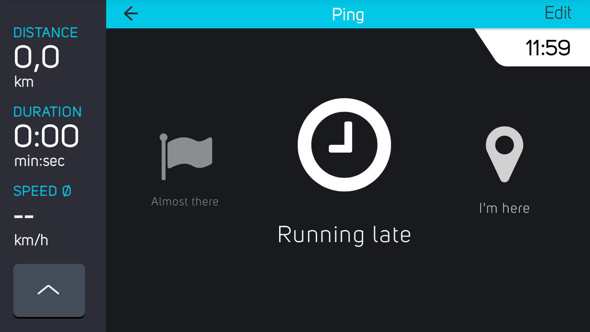

# Ping DevKit module for COBI.bike

The Ping DevKit module allows users to send prefabricated SMS to their contacts on the fly.
Its part of a collection of Open Source [modules](https://cobi.bike/devkit) for the [COBI.bike](https://cobi.bike) system.



## Quickstart: Interactive Demo

The quickest way to test the module via [Glitch.com](https://glitch.com):

[](https://glitch.com/edit/#!/import/github/cobi-bike/Module-Ping)

Glitch.com allows you to edit, host and fork Node.js applications for quick prototyping.
Follow the [installation step 2](#installation-and-setup) and copy the environment variables to the: `.env` file on Glitch.com

## Overview
This module relies on [Twilio.com](https://www.twilio.com/) to send custom SMS from a Node.js backend.

The backend serves a static web page to the client, which allows the user to pick between several prefabricated messages. After choosing a message, the user has to select a recipient from his contacts. The message is then sent back to the Node.js backend, which will forward to message to Twilio.

The backend enforces a maximum message quota by IP address.

## Installation and Setup

You can easily deploy the module on your own:

### Step 1: Clone repository

Clone this repository and install Node.js dependencies with:

``` bash
npm install
```  

### Step 2: Create a twilio account

This module relies on [Twilio.com](https://www.twilio.com/) to send custom SMS from the Node.js backend. Create an account, setup »Programmable SMS« and retrieve your api credentials. For testing purposes consider using test credentials found in the General Settings.

### Step 3: Set environment variables

Set the environment variables `TWILIO_ACCOUNT_SID`,  `TWILIO_AUTH_TOKEN` and `TWILIO_FROM_NUMBER` with your twilio credentials.

### Step 4: Run Node.js server

The module is accessible under [localhost:3000](http://localhost:3000/) after starting the Node.js server with:
``` bash
node server.js
```  
The settings menu can be accessed with the [?state=edit](http://localhost:3000/?state=edit) suffix.

### Step 5: Spoof contact menu

The module accesses a native contact menu through a Cobi.js API bridge. To send a message anyway, we simply spoof the API function:
``` javascript
COBI.app.contact.read = function(callback) {
	var contact = {};
	contact.phone = '+49 1234 56789';
	callback(contact);
}
```

### _Optional_: Install COBI.bike DevKit Simulator

Follow the [instructions](https://github.com/cobi-bike/DevKit#-test-your-module) to install the COBI.bike Google Chrome Simulator and get familiar with the basics of module development on the COBI plattform.

## Credits
This module uses Open Source components. You can find the source code of their open source projects along with license information below. We acknowledge and are grateful to these developers for their contributions to open source.

[Carousel Team](https://codepen.io/fixcl/pen/KwpKvb) by Marco Barría (MIT)

## Useful DevKit links

* [Debugging Tips & Tricks](https://github.com/cobi-bike/DevKit#debugging-tips--tricks)
* [Inspiration & Examples](https://github.com/cobi-bike/DevKit#inspiration--examples)
* [Interface Guidelines](https://github.com/cobi-bike/DevKit#interface-guidelines)
* [More DevKit Resources](https://github.com/cobi-bike/DevKit#inspiration--examples)
* [Other Tools & Resources](https://github.com/cobi-bike/DevKit#other-tools--resources)


## Contributing to this project

Anyone and everyone is welcome to contribute to this project, the [DevKit Simulator](https://github.com/cobi-bike/DevKit-Simulator) and the [DevKit UI Components](https://github.com/cobi-bike/DevKit-UI). Please take a moment to review the [guidelines for contributing](https://github.com/cobi-bike/DevKit/blob/master/CONTRIBUTING.md).

* [Bug reports](https://github.com/cobi-bike/DevKit/blob/master/CONTRIBUTING.md#bugs)
* [Feature requests](https://github.com/cobi-bike/DevKit/blob/master/CONTRIBUTING.md#features)
* [Pull requests](https://github.com/cobi-bike/DevKit/blob/master/CONTRIBUTING.md#pull-requests)

Copyright © 2018 COBI.bike GmbH
platform